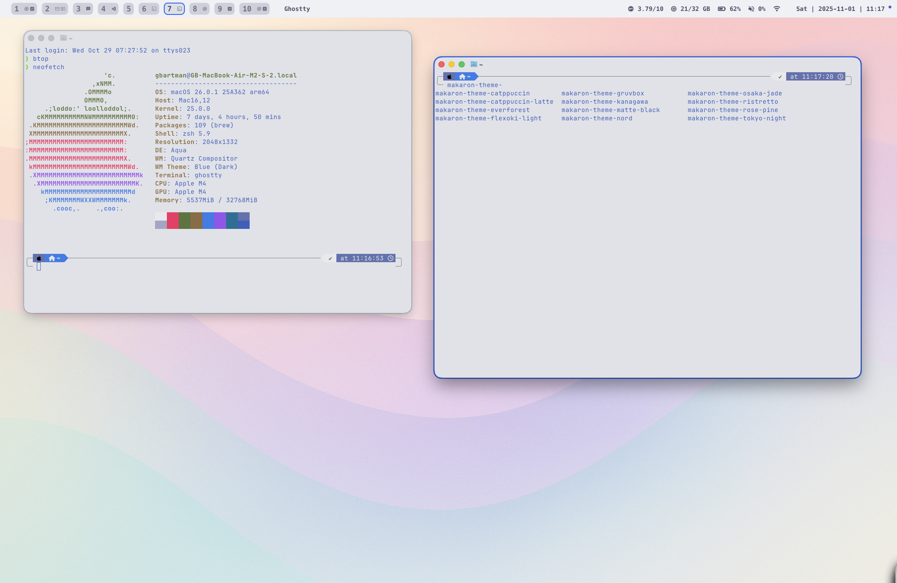
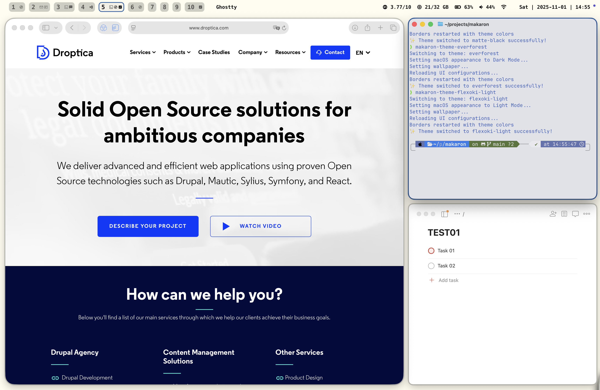

# Makaron - macOS Developer Configuration


> **Why "Makaron"?** The name comes from the Polish word for "pasta" 🍝, which sounds similar to "Mac" at the beginning - a playful nod to macOS while keeping a Polish identity.

Complete macOS development environment for PHP and Drupal developers with modern window management, terminal, and productivity tools.

## Perfect for

- **PHP Developers** - Optimized workflow for PHP development
- **Drupal Developers** - Tailored environment for Drupal projects
- **Web Developers** - Modern tools and efficient window management
- **Terminal Users** - Enhanced terminal experience with Ghostty
- **Productivity Enthusiasts** - Clean, distraction-free development setup

## Requirements

- macOS (tested on macOS 26)
- Homebrew installed
- Git

## Quick Installation

Install everything with one command:

```bash
curl -sL https://raw.githubusercontent.com/grzegorzbartman/makaron/main/install.sh | bash
```

This will:
- Clone the repository to `~/.local/share/makaron`
- Install Homebrew package manager
- Set up modern development environment (AeroSpace, SketchyBar, Ghostty)
- Configure system settings for optimal development workflow
- Install developer fonts and tools

## What Gets Installed

### UI & Window Management
- **AeroSpace** - Modern tiling window manager
- **SketchyBar** - Custom status bar
- **Borders** - Visual window borders
- **Nerd Fonts** - Developer-friendly fonts with icon support
- **ChatGPT** - AI assistant desktop app
- **Codex** - AI code assistant
- **Dozer** - Hide menu bar icons
- **Sublime Text** - Text editor

### Development Tools
- **Cursor** - AI-powered code editor
- **Docker Desktop** - Container platform
- **DDEV** - Local PHP development environment
- **PhpStorm** - Professional PHP IDE
- **Sequel Ace** - MySQL/MariaDB database management
- **VSCode** - Popular code editor
- **Composer** - PHP dependency manager
- **LazyDocker** - Terminal UI for Docker
- **LazyGit** - Terminal UI for Git
- **Node.js** - JavaScript runtime (includes Yarn)
- **pipx** - Python application installer
- **rbenv** - Ruby version manager

### Productivity Tools
- **Ghostty** - Fast, modern terminal emulator
- **Alt-Tab** - Windows-style alt-tab for macOS
- **Slack** - Team communication
- **Stats** - System monitor in menu bar
- **btop** - System resource monitor
- **Neovim** - Modern Vim-based text editor
- **Platform.sh CLI** - Platform.sh command-line tool
- **tmux** - Terminal multiplexer

### System Configuration
- **macOS Settings** - Optimized system preferences for development workflow
- **Migration System** - Safe, incremental configuration updates

## Manual Installation

If you prefer manual installation:

```bash
cd ~/projects
git clone https://github.com/grzegorzbartman/makaron.git
cd makaron
./install.sh
```

## Updates

To update your installation to the latest version:

```bash
makaron-update
```

This command will:
- Pull the latest changes from GitHub
- Run any pending migrations
- Reload all configurations

## Usage

### Available Commands

After installation, you'll have access to these commands:

- **`makaron-update`** - Update configuration to latest version
- **`makaron-reload-aerospace-sketchybar`** - Reload all configurations (AeroSpace, SketchyBar)
- **`makaron-reinstall`** - Complete reinstall from scratch
- **`makaron-migrate`** - Run pending migrations
- **`makaron-migration-status`** - Show migration status
- **`makaron-dev-add-migration`** - Create new migration (development)
- **`makaron-theme-tokyo-night`** - Switch to Tokyo Night theme
- **`makaron-theme-catppuccin`** - Switch to Catppuccin theme
- **`makaron-theme-catppuccin-latte`** - Switch to Catppuccin Latte theme
- **`makaron-theme-everforest`** - Switch to Everforest theme
- **`makaron-theme-flexoki-light`** - Switch to Flexoki Light theme
- **`makaron-theme-gruvbox`** - Switch to Gruvbox theme
- **`makaron-theme-kanagawa`** - Switch to Kanagawa theme
- **`makaron-theme-matte-black`** - Switch to Matte Black theme
- **`makaron-theme-nord`** - Switch to Nord theme
- **`makaron-theme-osaka-jade`** - Switch to Osaka Jade theme
- **`makaron-theme-ristretto`** - Switch to Ristretto theme
- **`makaron-theme-rose-pine`** - Switch to Rose Pine theme
- **`./install/macos_settings.sh`** - Apply macOS settings (optional)

### Themes

Makaron includes twelve beautiful themes that change the colors of your UI and wallpaper (based on [Omarchy](https://github.com/basecamp/omarchy)):

<p align="center">
  
  
</p>

<p align="center">
  
  
  
</p>

1. **Tokyo Night** (default) - Dark theme with purple/blue accents
2. **Catppuccin Mocha** - Dark theme with pastel colors
3. **Catppuccin Latte** - Light theme for daytime use
4. **Everforest** - Dark theme with green forest colors
5. **Flexoki Light** - Light theme with modern colors
6. **Gruvbox** - Dark theme with warm retro colors
7. **Kanagawa** - Dark theme inspired by Japanese art
8. **Matte Black** - Minimalist dark theme
9. **Nord** - Cool arctic-inspired color palette
10. **Osaka Jade** - Dark theme with jade green accents
11. **Ristretto** - Warm dark theme with coffee tones
12. **Rose Pine** - Light theme with rose and pine colors

Switch themes instantly with:

```bash
makaron-theme-tokyo-night         # Dark purple/blue
makaron-theme-catppuccin           # Dark pastel
makaron-theme-catppuccin-latte     # Light pastel
makaron-theme-everforest           # Dark forest green
makaron-theme-flexoki-light        # Light modern
makaron-theme-gruvbox              # Dark retro warm
makaron-theme-kanagawa             # Dark Japanese art
makaron-theme-matte-black          # Minimalist dark
makaron-theme-nord                 # Cool arctic
makaron-theme-osaka-jade           # Dark jade green
makaron-theme-ristretto            # Dark coffee warm
makaron-theme-rose-pine            # Light rose/pine
```

Each theme includes:
- Custom color scheme for SketchyBar
- Matching window border colors
- Coordinated desktop wallpaper

### Manual Commands

- **Reload config**: `makaron-reload-aerospace-sketchybar`
- **macOS settings**: `./install/macos_settings.sh` (optional)

### Troubleshooting

If you encounter issues with your installation:

- **Complete reinstall**: `makaron-reinstall` - Removes everything and reinstalls from scratch
- **Check migration status**: `makaron-migration-status` - See which migrations have been applied
- **Manual migration**: `makaron-migrate` - Run pending migrations manually

#### Common Issues After Fresh Installation

**Problem: Commands `makaron-*` are not available in terminal**

After installation, you need to reload your shell to make the commands available:

```bash
# Option 1: Reload your shell configuration
source ~/.zshrc

# Option 2: Restart your terminal completely
# Close and reopen your terminal application
```

The install script adds `~/.local/share/makaron/bin` to your PATH in `~/.zshrc` and `~/.bashrc`. If commands still don't work after reloading:

```bash
# Verify PATH is correct
echo $PATH | grep makaron

# If not found, manually add to your shell config
echo 'export PATH="$HOME/.local/share/makaron/bin:$PATH"' >> ~/.zshrc
source ~/.zshrc
```

**Problem: Top bar (menu bar) is not auto-hiding**

The menu bar autohide is configured through macOS settings. To enable it:

```bash
# Run the macOS settings script
~/.local/share/makaron/install/macos_settings.sh

# Then restart SystemUIServer to apply changes
killall SystemUIServer
```

Alternatively, enable it manually:
1. Open **System Settings**
2. Go to **Desktop & Dock**
3. Enable **Automatically hide and show the menu bar**

**Note**: On some macOS versions, you might need to log out and log back in for the menu bar autohide to take effect.

**Problem: SketchyBar or AeroSpace not working properly**

Try reloading the configuration:

```bash
makaron-reload-aerospace-sketchybar
```

If that doesn't help, check if the services are running:

```bash
# Check if AeroSpace is running
pgrep -x "AeroSpace" || open -a AeroSpace

# Check if SketchyBar is running
pgrep -x "sketchybar" || brew services restart sketchybar
```

## Keyboard Shortcuts

**Window Management:**
- `Ctrl+Alt+H/J/K/L` - Focus window (left/down/up/right)
- `Alt+Shift+H/J/K/L` - Move window (left/down/up/right)
- `Alt+Minus/Equal` - Resize window (decrease/increase)
- `Alt+Slash` - Toggle horizontal/vertical tiles layout
- `Alt+Comma` - Toggle horizontal/vertical accordion layout
- `Alt+F` - Toggle floating/tiling mode
- `Alt+Shift+Semicolon` - Enter service mode

**Workspaces:**
- `Alt+1-9/0` - Switch to workspace 1-10
- `Alt+Shift+1-9/0` - Move window to workspace 1-10
- `Alt+Left/Right` - Switch to previous/next workspace
- `Cmd+Alt+Left/Right` - Move window to previous/next workspace

**Service Mode:**
- `Alt+Shift+Semicolon` - Enter service mode
- `Esc` - Exit service mode and reload config
- `R` - Reset layout (flatten workspace tree)
- `F` - Toggle floating/tiling mode
- `Backspace` - Close all windows except current
- `Alt+Shift+H/J/K/L` - Join with adjacent window (left/down/up/right)
- `Up/Down` - Volume up/down
- `Shift+Down` - Mute volume (set to 0)

**Quick Apps:**
- `Ctrl+Alt+B` - Safari
- `Ctrl+Alt+C` - Cursor
- `Ctrl+Alt+T` - iTerm
- `Ctrl+Alt+P` - PhpStorm
- `Ctrl+Alt+Z` - Todoist
- `Ctrl+Alt+N` - Notes (new note)
- `Ctrl+Alt+M` - Mimestream

## Modular Installation

All installation scripts are modular and organized in the `install/` directory:

```
install/
├── desktop/      # Window manager, status bar, system UI
├── terminal/     # Terminal emulators and CLI utilities
├── editors/      # IDEs and text editors
├── development/  # Languages, frameworks, dev tools
├── apps/         # GUI applications
└── macos_settings.sh
```

You can customize your installation by modifying which scripts run in `install/all.sh`, or run individual installation scripts directly.

## Files

- `configs/aerospace/.aerospace.toml` - AeroSpace config
- `configs/ghostty/config` - Ghostty terminal config
- `configs/sketchybar/sketchybarrc` - SketchyBar status bar config
- `install/` - Modular installation scripts
  - `brew.sh` - Homebrew package manager installation
  - `desktop/` - Desktop environment (AeroSpace, SketchyBar, fonts)
  - `terminal/` - Terminal tools (Ghostty, tmux, CLI utils)
  - `editors/` - Text editors and IDEs
  - `development/` - Development tools (Languages, Docker)
  - `apps/` - GUI applications
  - `macos_settings.sh` - macOS system settings
  - `migrations.sh` - Migration system initialization
- `migrations/` - Database-style migrations for configuration updates
- `bin/` - Executable scripts
  - `makaron-migrate` - Run pending migrations
  - `makaron-migration-status` - Show migration status
  - `makaron-dev-add-migration` - Create new migration (development)

## Migration System

Makaron includes a migration system similar to database migrations (like Rails or Drupal). This allows for safe, incremental updates to your configuration.

### How it works

- Migrations are timestamped shell scripts in the `migrations/` directory
- Each migration runs only once per installation
- State is tracked in `~/.local/state/makaron/migrations/`
- Migrations run automatically during `makaron-update`

### Creating Migrations

For development, use the helper script:

```bash
makaron-dev-add-migration
```

This creates a new migration file with the current timestamp and opens it in your editor.

### Migration Status

Check which migrations have been applied:

```bash
makaron-migration-status
```

### Manual Migration

Run pending migrations manually:

```bash
makaron-migrate
```

---

## ⚠️ Experimental Project

**Please note:** Makaron is an experimental project under active development. Some features may not work perfectly yet, and you might encounter bugs or unexpected behavior. We welcome feedback and contributions to help improve the project!

If you encounter any issues, please:
- Check existing [GitHub Issues](https://github.com/grzegorzbartman/makaron/issues)
- Try running `makaron-reinstall` for a clean setup
- Report new issues with details about your system and the problem

Your patience and feedback are appreciated as we continue to improve Makaron! 🙏
