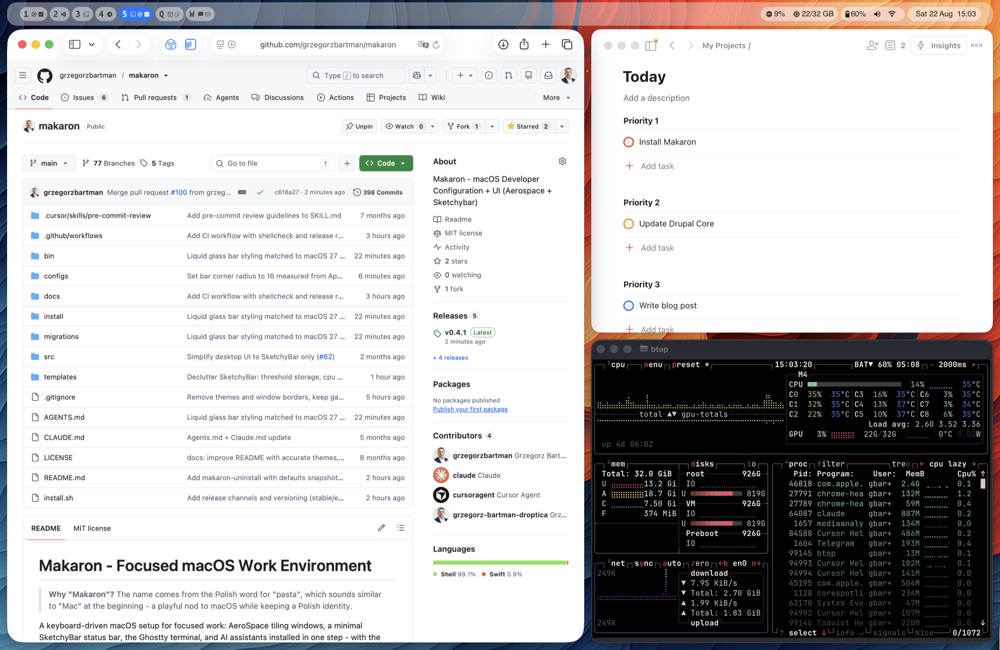

# Makaron - Focused macOS Work Environment

> **Why "Makaron"?** The name comes from the Polish word for "pasta", which sounds similar to "Mac" at the beginning - a playful nod to macOS while keeping a Polish identity.

A keyboard-driven macOS setup for focused work: AeroSpace tiling windows, a minimal SketchyBar status bar, the Ghostty terminal, and AI assistants installed in one step - with the Dock and menu bar hidden so your screen holds only what you are working on.



> [!NOTE]
> Makaron is an opinionated setup, but you don't need to fork it. Install it, follow the stable release channel, and customize it through override files in `~/.config/makaron/` that survive every update - see [Customizing Makaron](#customizing-makaron).

## Perfect For

- **Keyboard-driven workers** - Switch, tile, and resize windows without touching the mouse
- **Deep-work setups** - Hidden Dock, hidden menu bar, one compact status bar
- **AI-assisted workflows** - Claude Code, Codex, and Cursor ready right after install
- **Terminal users** - Ghostty plus fast CLI tools (fzf, btop, lazygit)
- **Developers** - Optional group with editors, containers, and language tooling

## Requirements

- macOS
- Internet connection
- Admin access for Homebrew packages and system settings

## Quick Installation

```bash
curl -sL https://raw.githubusercontent.com/grzegorzbartman/makaron/main/install.sh | bash
```

After installation, reload your shell or open a new terminal.

## What Gets Installed

### UI & Window Management
- **AeroSpace** - Modern tiling window manager
- **SketchyBar** - Custom top status bar with a translucent, macOS-native look; the disk indicator stays hidden until usage crosses its alert threshold
- **Nerd Fonts** - Icon-capable fonts for the status bar and terminal

### AI Tools
- **Claude Code** - AI coding assistant
- **Cursor** - AI-powered code editor
- **Codex** - AI code assistant

### Productivity Tools
- **Ghostty** - Fast, modern terminal emulator (configuration stays user-managed)
- **Stats** - System monitor in menu bar
- **btop** - System resource monitor
- **Neovim** - Modern Vim-based text editor
- **Upsun CLI** - Upsun command-line tool

### Development Tools (optional)
- **Docker Desktop** - Container platform
- **DDEV** - Local PHP development environment
- **Sequel Ace** - MySQL/MariaDB database management
- **VSCode** - Popular code editor
- **Composer** - PHP dependency manager
- **LazyDocker** - Terminal UI for Docker
- **LazyGit** - Terminal UI for Git
- **Node.js** - JavaScript runtime
- **pipx** - Python application installer

### System Configuration
- **macOS Settings** - System preferences tuned for tiling and distraction-free work
- **Migration System** - Safe, incremental configuration updates
- **User Config** - Personal settings in `~/.config/makaron/makaron.conf`

## Manual Installation

```bash
cd ~/projects
git clone https://github.com/grzegorzbartman/makaron.git
cd makaron
./install.sh
```

## Updates

To update your installation to the latest version:

```bash
makaron-update
```

This command will:
- Pull the latest changes from GitHub
- Run any pending migrations
- Reload configurations for the current UI mode

## Usage

### Available Commands

- **`makaron-update`** - Update to the latest release (`stable` channel, default) or latest `main` (`--edge`); `--stable`/`--edge` persist the choice
- **`makaron-version`** - Show installed version and update channel
- **`makaron-reload-aerospace-sketchybar`** - Reload AeroSpace + SketchyBar and re-apply layout
- **`makaron-reinstall`** - Complete reinstall from scratch
- **`makaron-migrate`** - Run pending migrations
- **`makaron-doctor`** - Concise health check with optional safe repairs (`--fix`, `--json`)
- **`makaron-ui-full`** - Start full UI (AeroSpace + SketchyBar, hidden Dock/menu bar)
- **`makaron-ui-stop`** - Stop UI components
- **`makaron-gaps <0-40>`** - Set persistent AeroSpace window gaps
- **`makaron-gaps-zero`** - Set window gaps to zero
- **`makaron-macos-config-reload`** - Apply macOS settings

### UI Modes

| Command | Components | Dock | Menu Bar | Layout |
|---|---|---|---|---|
| `makaron-ui-full` | AeroSpace + SketchyBar | Hidden | Hidden | configured gaps |
| `makaron-ui-stop` | Nothing | Visible | Visible | UI state not applied |

The default layout uses a `12px` gap. If the configured gap is `g`, a screen without a notch reserves `40 + g` pixels above windows for SketchyBar, while a notched built-in display uses `g`; external monitors always use `40 + g`. For example:

```bash
makaron-gaps 12
```

### Manual Commands

- **Reload config**: `makaron-reload-aerospace-sketchybar`
- **macOS settings**: `makaron-macos-config-reload`

## Troubleshooting

If you encounter issues with your installation:

- **Quick health check**: `makaron-doctor`
- **Safe automatic repairs**: `makaron-doctor --fix`
- **Complete reinstall**: `makaron-reinstall`
- **Manual migration**: `makaron-migrate`

### Common Issues After Fresh Installation

**Problem: Commands `makaron-*` are not available in terminal**

After installation, reload your shell:

```bash
source ~/.zshrc
```

Or restart your terminal completely. If commands still do not work:

```bash
echo $PATH | grep makaron
echo 'export PATH="$HOME/.local/share/makaron/bin:$PATH"' >> ~/.zshrc
source ~/.zshrc
```

**Problem: Top bar or menu bar settings are wrong**

Makaron switches the menu bar through UI mode helpers:

```bash
makaron-ui-full
makaron-reload-aerospace-sketchybar
```

If macOS blocks the menu bar UI automation, open **System Settings > Control Center > Menu Bar** and set it manually.

**Problem: AeroSpace workspaces are not highlighted correctly**

Reload AeroSpace and SketchyBar:

```bash
aerospace reload-config
makaron-reload-aerospace-sketchybar
```

**Problem: Wrong workspaces after monitor changes**

```bash
sketchybar --reload
makaron-reload-aerospace-sketchybar
```

## Keyboard Shortcuts

Keyboard shortcuts are configured in `configs/aerospace/.aerospace.toml`.

Common defaults include:
- `alt-h/j/k/l` - Focus windows
- `alt-shift-h/j/k/l` - Move windows
- `alt-1..9` - Switch workspaces
- `alt-shift-1..9` - Move window to workspace
- `alt-f` - Toggle fullscreen

Review the AeroSpace config for the full list.

## Modular Installation

The installation is modular. Core install flow:

```text
install/
├── all.sh              # Main orchestrator
├── mandatory.sh        # Core requirements
├── packages.sh         # Optional package selector
├── brew.sh             # Homebrew setup
├── desktop/            # AeroSpace, SketchyBar, fonts
├── terminal/           # Ghostty and terminal helpers
├── editors/            # Editor application installers
├── development/        # Languages, frameworks, dev tools
└── macos_settings.sh
```

## Files

- `configs/aerospace/.aerospace.toml` - AeroSpace config
- `configs/sketchybar/colors.sh` - SketchyBar color palette
- `configs/sketchybar/sketchybarrc` - SketchyBar status bar config
- `configs/sketchybar/plugins/` - SketchyBar plugin scripts
- `install/` - Modular installation scripts
- `migrations/` - Database-style migrations for configuration updates
- `templates/makaron.conf.default` - Default user configuration template
- `bin/` - Executable scripts

## Migration System

Makaron includes a migration system similar to database migrations. This allows safe, incremental updates to your configuration.

### How It Works

- Migrations are timestamped shell scripts in `migrations/`
- Each migration runs only once per installation
- State is tracked in `~/.local/state/makaron/migrations/`
- Migrations run automatically during `makaron-update`

## Customizing Makaron

Your overrides live in `~/.config/makaron/` and survive every update. Example templates (`*.example`) are seeded there on install - rename one to activate it, then apply with:

```bash
makaron-reload-aerospace-sketchybar
```

| File | What it overrides |
|---|---|
| `aerospace.user.toml` | Keybindings, app-to-workspace routing, float rules, any AeroSpace option |
| `colors.user.sh` | SketchyBar colors (bar, workspaces, focus highlight) |
| `sketchybar.user.sh` | Bar items: remove built-in widgets, add your own |
| `icons.user.sh` | Workspace app icons (Nerd Font glyphs) |

Examples:

```toml
# ~/.config/makaron/aerospace.user.toml
[mode.main.binding]
alt-enter = 'exec-and-forget open -na Ghostty'   # add a keybinding

[[on-window-detected]]                            # route an app (overrides base rules)
if.app-id = "com.spotify.client"
run = ["move-node-to-workspace 5"]
```

```bash
# ~/.config/makaron/colors.user.sh
export SPACE_FOCUSED_BACKGROUND_COLOR=0xffff375f  # change the focus color
```

Your AeroSpace keys win over the base config; your window rules run before Makaron's routing/float rules. The `[gaps]` block stays managed by `makaron-gaps`. A broken override file never breaks the desktop - Makaron falls back to the base config and `makaron-doctor` tells you why. Layout scalars live in `~/.config/makaron/makaron.conf` (`AEROSPACE_GAP_SIZE`, `SKETCHYBAR_HEIGHT`, `AEROSPACE_AUTO_DWINDLE`).

## Uninstall

```bash
makaron-uninstall
```

Stops the UI, restores macOS settings (from a snapshot taken at install time when available), removes symlinks, PATH entries, services, and Makaron itself. Optionally uninstalls the Homebrew packages Makaron installed - you choose. `--dry-run` shows the full plan first. Note: on setups installed before snapshotting existed, macOS settings revert to Apple factory defaults rather than your exact previous values.

## Releases and Update Channels

Makaron ships as tagged releases (`vX.Y.Z`). By default `makaron-update` follows the **stable** channel and resets to the latest release tag. Switch channels with:

```bash
makaron-update --edge     # follow latest main
makaron-update --stable   # back to releases
```

The choice is stored as `MAKARON_CHANNEL` in `~/.config/makaron/makaron.conf`.

### Creating Migrations

Create a new timestamped shell script in `migrations/` and make it executable:

```bash
chmod +x migrations/TIMESTAMP.sh
```

### Manual Migration

```bash
makaron-migrate
```

## User Configuration

Personal settings are stored in `~/.config/makaron/makaron.conf`. This file is created on install and preserved during updates. New variables added later get appended on update; existing values are never overwritten.

Available settings:

```bash
BATTERY_LOW_THRESHOLD=20                # Battery warning threshold (%)
SKETCHYBAR_COMPACT_MODE=false           # Hide CPU/memory/storage widgets on the right side
SKETCHYBAR_HIDE_EMPTY_WORKSPACES=false  # Hide empty, non-focused workspaces in the bar
AEROSPACE_SWIPE_FINGERS=4               # Fingers used to switch workspaces
AEROSPACE_SWIPE_NATURAL=true            # Use the natural macOS swipe direction
AEROSPACE_GAP_SIZE=12                    # Window gap in pixels (0-40)
CPU_ALERT_THRESHOLD=80                   # CPU turns alert color above this usage (%)
MEMORY_ALERT_THRESHOLD=80                # Memory turns alert color above this usage (%)
STORAGE_ALERT_THRESHOLD=90               # Show disk only above this usage (%)
```

## Contributing

Contributions are welcome:

1. Fork the repository
2. Create a feature branch
3. Commit your changes
4. Push to the branch
5. Open a pull request

Please read [AGENTS.md](AGENTS.md) for development guidelines and code style.

## License

This project is licensed under the MIT License - see the [LICENSE](LICENSE) file for details.
